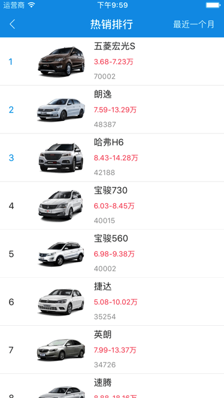

#### 自定义ActionSheet，自动布局。

#####使用示例:
 1. ###### #import "HCActionSheet.h"
 2. 遵守协议 HCActionSheetDelegate

```
    HCActionSheet *actionSheet = [HCActionSheet actionSheet];
    actionSheet.delegate = self;
    [actionSheet showActionSheetWithSheetTitles:@[@"男",@"女",@"取消"]];
```
```
#pragma mark - <HCActionSheetDelegate>

- (void)actionSheet:(HCActionSheet *)actionSheet clickedButtonAtIndex:(NSInteger)buttonIndex{
    if (buttonIndex == 0) {
        _tipLabel.text = @"男";
    }else if (buttonIndex == 1){
        _tipLabel.text = @"女";
    }else{
        _tipLabel.text = @"取消";
    }
}

```
#####效果演示:

    
